<div align="center">

# OrbitOps

### Approval-first multi-agent business automation

Turn a lead into researched, reviewed, delivered, and auditable business action through one production-oriented workflow.

[](https://github.com/Ubaith444/OrbitOps/actions/workflows/ci.yml)


[Architecture](docs/architecture.md) · [API](docs/api.md) · [Testing](docs/testing-report.md) · [Deployment](docs/deployment.md) · [Documentation](docs/README.md)

</div>

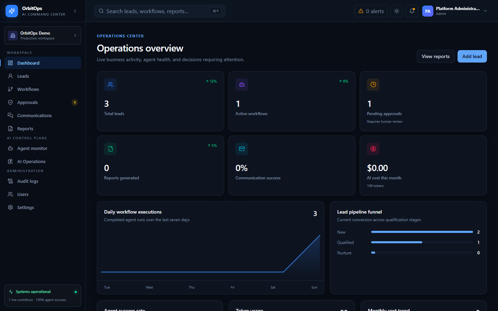

## Why OrbitOps?

Most AI demos stop after generating text. OrbitOps treats generation as the beginning of an operational process:

```text
Login → Create Lead → Sales Agent → Research Agent → Email Draft
→ Human Approval → Communication Delivery → Report → Immutable Audit
```

The platform combines agent orchestration with the controls a real business needs: tenant isolation, role-based access, approval gates, retries, delivery tracking, token/cost observability, prompt versioning, and durable evidence.

## Product tour

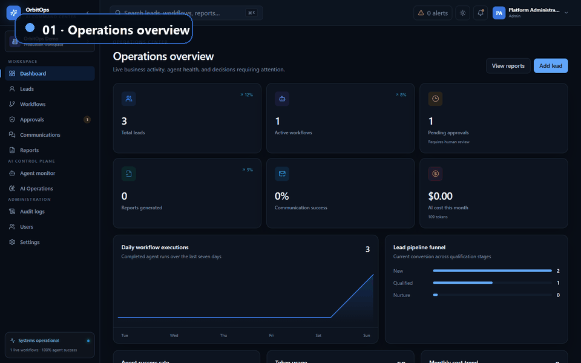

### What makes this more than an AI demo

- **Human control:** outbound drafts pause at an idempotent approval gate.
- **Reliable agents:** failures persist a resumable node, timing, attempt, and error category.
- **Multi-LLM routing:** OpenAI, Anthropic Claude, Google Gemini, and deterministic mock routes with fallback history.
- **AI operations:** execution success, latency, retries, evaluations, feedback, token usage, and estimated cost.
- **Communication intelligence:** signed webhook processing, duplicate protection, reply classification, retry, and dead-letter handling.
- **Multi-tenant security:** every protected query is scoped from the verified JWT tenant claim.
- **Auditability:** business decisions and provider lifecycle events are append-only.

## Architecture

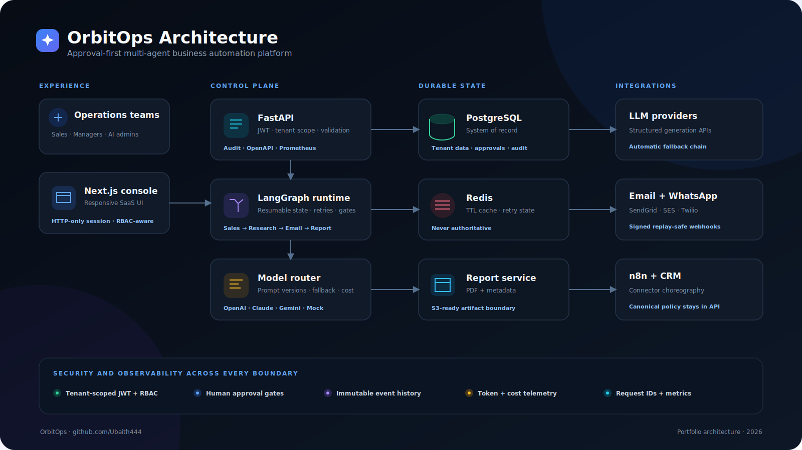

PostgreSQL is the durable source of truth. Redis is disposable acceleration and retry infrastructure. FastAPI owns authentication, authorization, tenancy, policy, and audit. LangGraph owns resumable agent execution—but never permission decisions.

[Read the architecture deep dive →](docs/architecture.md)

<details>
<summary><strong>View Mermaid architecture source</strong></summary>

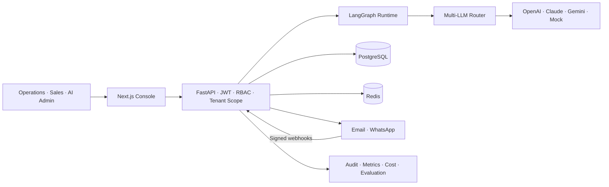

</details>

## LangGraph workflow

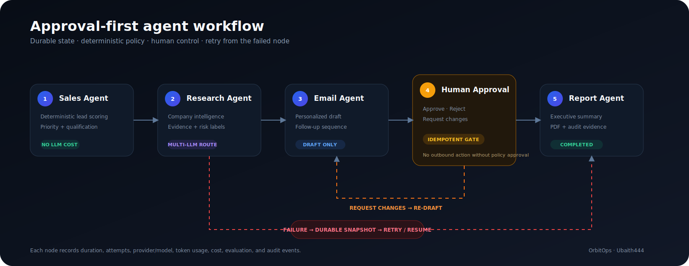

The implemented graph runs five active nodes: Sales, Research, Email Draft, Approval Gate, and Report. Every model call records provider, model, tokens, cost, latency, prompt version, fallback history, and evaluation.

[Read the workflow design →](docs/langgraph-workflow.md)

## Screenshots

| Workflow orchestration | Human approval |
|---|---|
| 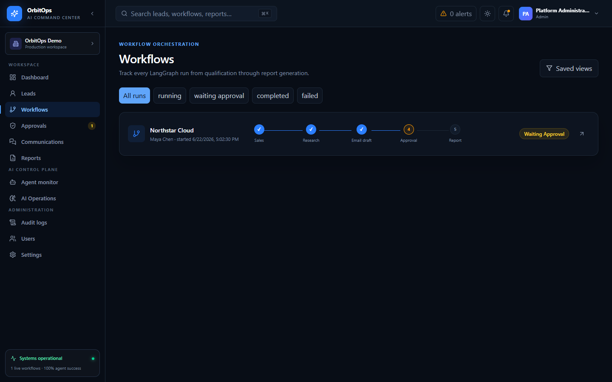 | 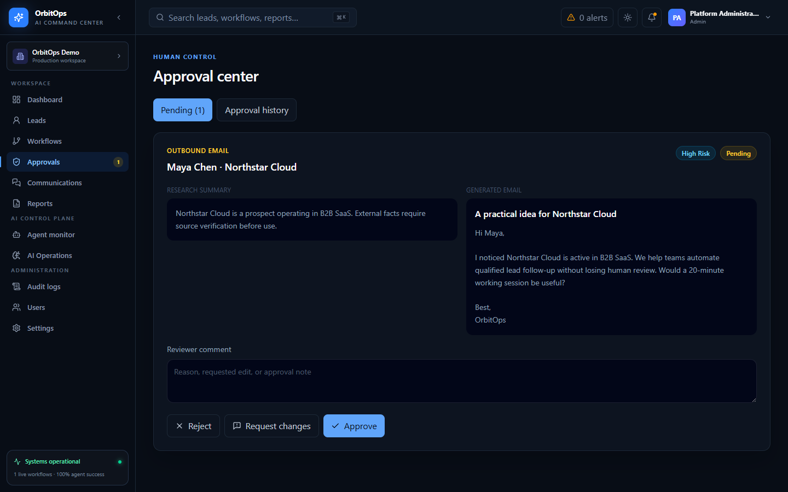 |

| AI Operations | Reports |
|---|---|
| 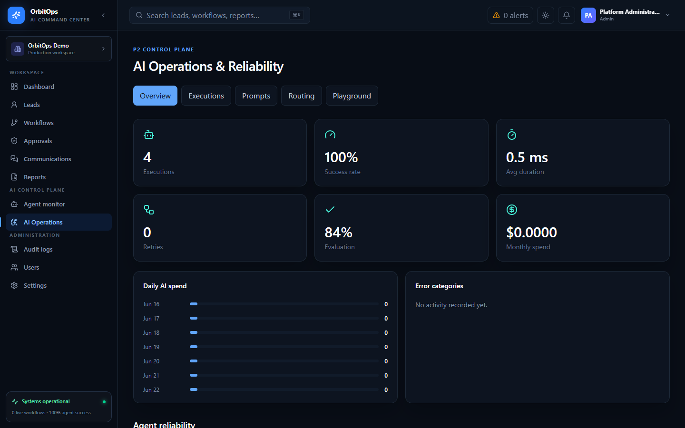 | 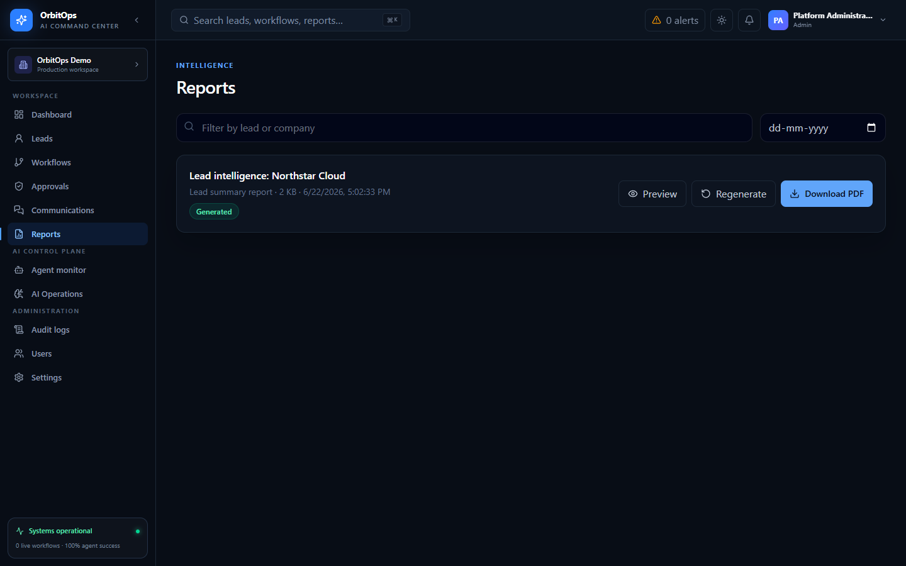 |

| Communication Center | Agent Monitoring |
|---|---|
| 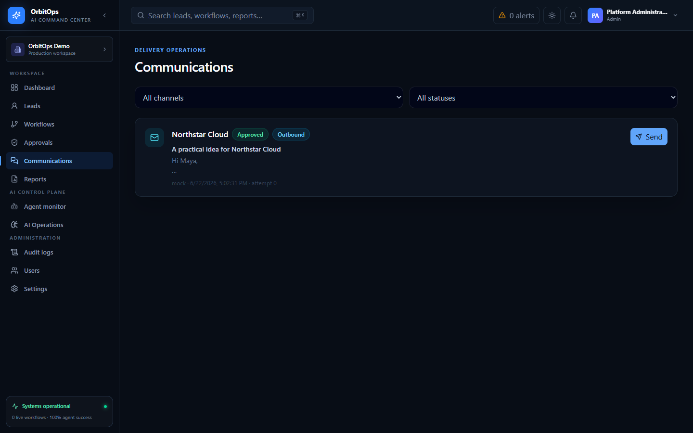 | 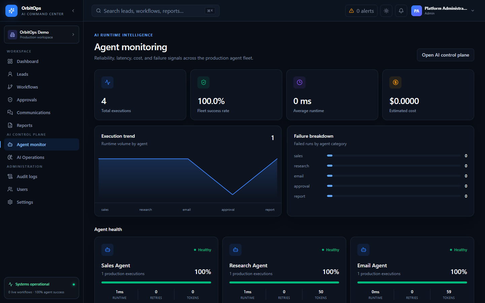 |

| Lead management | Mobile experience |
|---|---|
| 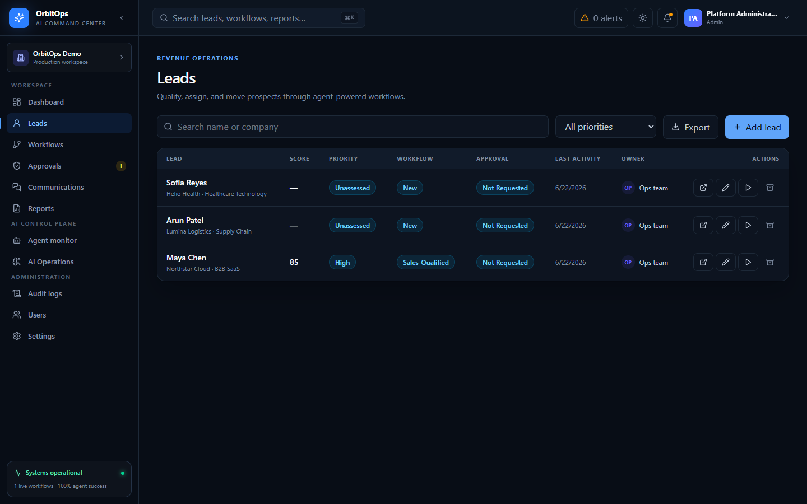 | 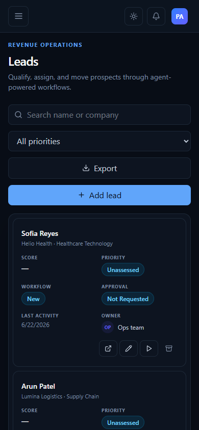 |

### Approval flow

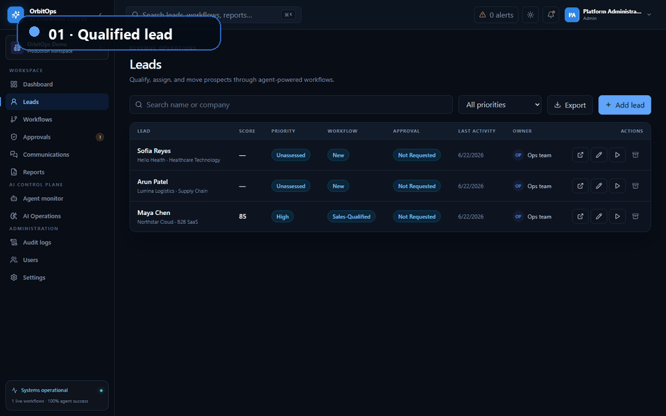

<details>
<summary><strong>View the mobile demo</strong></summary>

<br />

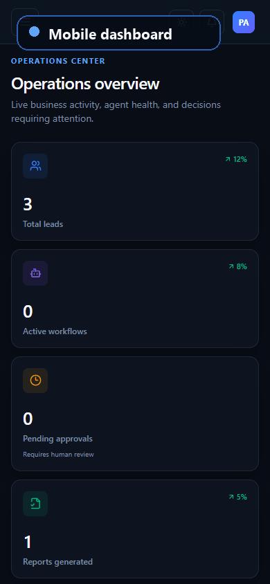

</details>

## Technology stack

| Layer | Technology |
|---|---|
| Frontend | Next.js 15, React 19, TypeScript, Tailwind CSS, Radix primitives |
| API | FastAPI, Pydantic, SQLAlchemy async, JWT |
| Agents | LangGraph, provider-neutral model router, versioned prompts |
| Models | OpenAI, Anthropic Claude, Google Gemini, deterministic mock |
| Data | PostgreSQL 16, Redis 7, Alembic |
| Automation | n8n templates, email/WhatsApp adapters, signed webhooks |
| Reports | ReportLab PDF generation |
| Observability | Structured logs, Prometheus metrics, optional LangSmith |
| Delivery | Docker Compose, Nginx, AWS deployment contract, GitHub Actions |
| Quality | pytest, Playwright, Ruff, TypeScript production build |

## Current quality evidence

| Gate | Result |
|---|---:|
| Backend automated tests | **20 passed** |
| Browser E2E scenarios | **3 passed** |
| Portfolio capture test | **1 passed** |
| Next.js production routes | **18 built** |
| TypeScript validation | **Passed** |

The automated suite covers authentication, JWT tenancy, RBAC, tenant isolation, lead CRUD, LangGraph execution, retry/resume, approval idempotency, PDF reports, immutable audit, signed webhooks, duplicate events, reply classification, provider outage, dead-letter handling, model fallback, cost tracking, prompt versions, feedback, and the browser vertical slice.

[Read the evidence and production gaps →](docs/testing-report.md)

## Quick start with Docker

### Prerequisites

- Docker Desktop or Docker Engine with Compose v2
- Git
- 4 GB available memory

### 1. Clone

```bash
git clone https://github.com/Ubaith444/OrbitOps.git
cd OrbitOps
```

### 2. Configure

macOS/Linux:

```bash
cp .env.example .env
```

PowerShell:

```powershell
Copy-Item .env.example .env
```

Replace the development secrets in `.env`. Keep these safe defaults for the first run:

```dotenv
LLM_DEFAULT_PROVIDER=mock
LIVE_LLM_ENABLED=false
DELIVERY_ENABLED=false
```

### 3. Start

```bash
docker compose up --build -d
docker compose ps
```

### 4. Open OrbitOps

| Service | URL |
|---|---|
| Application through Nginx | http://localhost:8080 |
| Next.js console | http://localhost:3000 |
| FastAPI OpenAPI | http://localhost:8000/docs |
| API readiness | http://localhost:8000/health/ready |

Use the bootstrap admin credentials you configured in `.env`. No working password is committed to the repository.

### 5. Stop

```bash
docker compose down
```

Do not add `-v` unless you intentionally want to delete local PostgreSQL and Redis data.

## Local development

Backend:

```bash
cd apps/api
python -m venv .venv
source .venv/bin/activate        # Windows: .venv\Scripts\activate
pip install -e ".[dev]"
alembic upgrade head
uvicorn app.main:app --reload
```

Frontend:

```bash
cd apps/web
pnpm install --frozen-lockfile
pnpm dev
```

Run quality gates:

```bash
cd apps/api && pytest -q
cd ../web && pnpm typecheck && pnpm build && pnpm test:e2e
```

## Repository structure

```text
OrbitOps/
├── apps/
│   ├── api/                  FastAPI, LangGraph, models, migrations, tests
│   └── web/                  Next.js operations console and Playwright
├── agents/                   Agent subsystem guide; implementation map
├── workflows/                LangGraph and n8n workflow boundaries
├── tests/                    Cross-project testing guide
├── docs/
│   ├── assets/               Screenshots, GIF demos, architecture visuals
│   ├── architecture.md       System boundaries and reliability model
│   ├── database-schema.md    ERD, constraints, migration policy
│   ├── langgraph-workflow.md Agent nodes, state, approval, retry/resume
│   ├── api.md                Endpoint and webhook reference
│   ├── rbac-matrix.md        Role and tenant-isolation contract
│   ├── deployment.md         Compose and AWS runbook
│   └── testing-report.md     Current evidence and open risks
├── infra/                    Nginx, monitoring, AWS contract
├── docker/                   Container and Compose guide
├── n8n/                      Importable workflow templates
├── scripts/                  Portfolio asset generation
├── docker-compose.yml
└── .github/workflows/ci.yml
```

## Documentation

- [Documentation index](docs/README.md)
- [System architecture](docs/architecture.md)
- [Database schema](docs/database-schema.md)
- [LangGraph workflow](docs/langgraph-workflow.md)
- [API reference](docs/api.md)
- [RBAC matrix](docs/rbac-matrix.md)
- [Deployment guide](docs/deployment.md)
- [Environment configuration](docs/environment.md)
- [Testing report](docs/testing-report.md)
- [n8n integration notes](docs/n8n-workflows.md)

## Roadmap

### P0 — Working vertical slice ✅

Authentication, tenant RBAC, lead creation, LangGraph execution, approval gates, PDF reports, immutable audit, and end-to-end browser coverage.

### P1 — Business operations ✅

Enterprise UI, lead/workflow dashboards, communication delivery history, signed webhooks, reply intelligence, retries, dead letters, reports, and mobile navigation.

### P2 — AI reliability ✅ alpha

Agent observability, token/cost tracking, multi-LLM fallback, prompt versioning, evaluations, human feedback, and model playground.

### Next

Production PostgreSQL/Redis resilience tests, provider sandbox certification, queue-based workers, S3 report storage, refresh-token revocation, enterprise SSO/SCIM, CRM integrations, and AWS canary deployment.

## Safety defaults and honest limitations

- The repository runs with deterministic mock LLM and delivery adapters by default.
- Real SendGrid, SES, Twilio, OpenAI, Claude, and Gemini calls require credentials and explicit enablement.
- Agent output never authorizes delivery by itself.
- The current automated API suite uses SQLite; production deployment requires PostgreSQL/Redis integration, load, security, backup/restore, and live-provider sandbox evidence documented in the testing report.

## Regenerate portfolio assets

After a production web build:

```bash
cd apps/web
PLAYWRIGHT_CHANNEL=chrome pnpm exec playwright test --config portfolio.playwright.config.ts
cd ../..
python scripts/build_portfolio_gifs.py
```

The capture uses only the local test environment, mock providers, and synthetic companies.

## Author

Built by [Ubaith444](https://github.com/Ubaith444) as a full-stack AI engineering portfolio project focused on reliable, observable, human-controlled agent systems.

If this project is useful, consider starring the repository.

## License

OrbitOps is released under the [MIT License](LICENSE).
