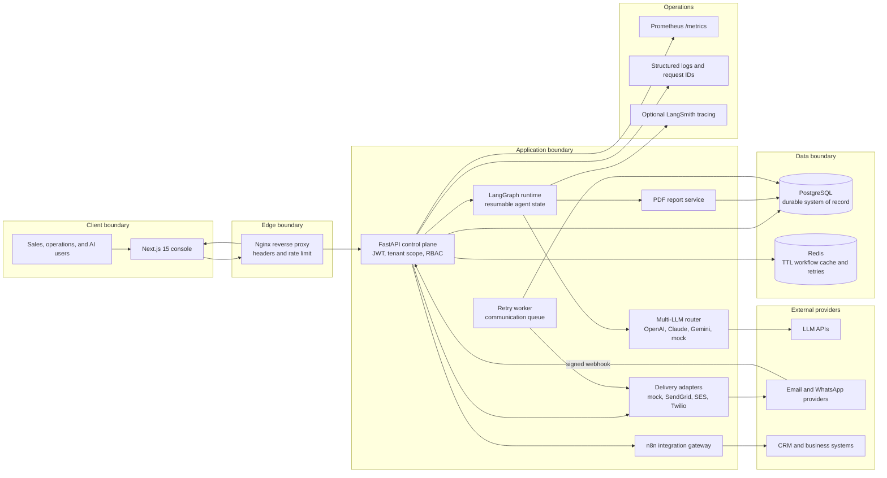
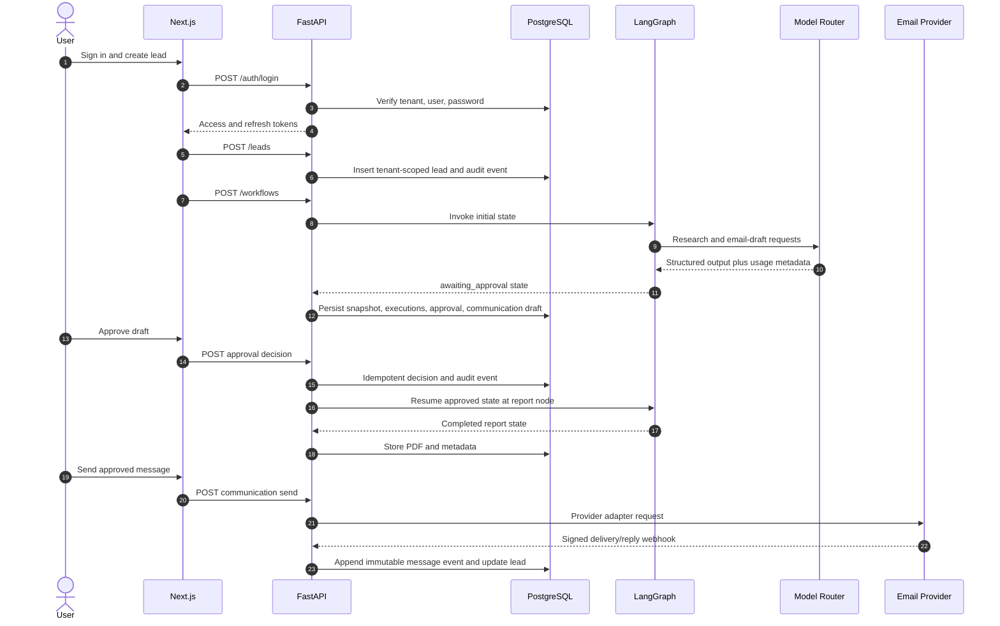

# OrbitOps System Architecture

## 1. Purpose and architectural stance

OrbitOps is a multi-tenant control plane for AI-assisted business operations. The platform combines deterministic business rules, LangGraph agents, mandatory human approval for outbound email, communication delivery tracking, report generation, and append-only audit evidence.

Three rules shape the architecture:

1. **PostgreSQL is authoritative.** Redis improves latency and resilience but is never the only copy of business state.
2. **Authorization is deterministic.** FastAPI derives the tenant and role from a verified JWT; an LLM cannot grant permission or bypass approval.
3. **Agent output is untrusted draft data.** External action requires validation and the configured approval/delivery policy.

## 2. Container architecture

## 3. Primary request flow

## 4. Component responsibilities

| Component | Owns | Explicitly does not own |
|---|---|---|
| Next.js | Session presentation, responsive UI, human workflows, API proxy routes | Permission decisions, provider secrets, canonical state |
| FastAPI | Authentication, tenant scope, RBAC, validation, API contracts, auditing | Long-lived browser state, LLM authorization decisions |
| LangGraph | Agent order, resumable state, failure capture, approval boundary | User authentication, delivery permission |
| Model router | Provider selection, fallback, usage and cost metadata | Business authorization or persistence |
| PostgreSQL | Users, leads, workflow snapshots, approvals, reports, telemetry, communications, audit | Short-lived cache behavior |
| Redis | Best-effort active-state cache and retry infrastructure | Sole copy of workflow or customer state |
| Worker | Due communication retries and dead-letter progression | Creation of workflow intent |
| n8n | Connector choreography and external automation | Canonical records or approval policy |

## 5. Trust boundaries and tenancy

- Login selects a workspace slug, then the JWT carries `sub`, `tenant`, `role`, token type, and expiry claims.
- Every protected request reloads the active user by both `user_id` and `tenant_id`.
- Business queries include `Model.tenant_id == user.tenant_id`; cross-tenant IDs return tenant-safe `404` responses.
- Webhooks are public only at the transport layer. They require timestamped HMAC signatures, a replay window, provider-event deduplication, and a known message identifier.
- `audit_logs` and `message_events` are append-only at the ORM layer; PostgreSQL migrations also install immutable triggers.
- Secrets belong in environment/secret management, never in graph state, audit details, or client bundles.

## 6. State and consistency model

| State | Durable location | Cache/derived location | Consistency rule |
|---|---|---|---|
| Lead and score | PostgreSQL `leads` | Dashboard aggregates | DB wins |
| Workflow | `workflow_runs.state_snapshot` | Redis key `orbitops:{tenant}:workflow:{run}` with TTL | Redis loss must not block execution |
| Approval | PostgreSQL `approvals` | UI query cache | Unique `(run_id, kind)` and idempotent decision |
| Report | PostgreSQL `reports` | Browser download | One report per run |
| Communication | `communication_messages` | Worker retry schedule | Provider ID unique per tenant/provider |
| Delivery history | `message_events` | Timeline projection | Append-only and provider event ID unique |
| Agent telemetry | executions, traces, evaluations, feedback | AI Operations summaries | Recomputed from tenant-scoped records |

## 7. Reliability and failure handling

- Agent nodes are guarded: exceptions become a `failed` phase with `resume_node`, timing, attempt, and error category.
- Retry starts from the recorded failed node instead of repeating completed work.
- Approval decisions are idempotent; conflicting second decisions return `409`.
- Report generation checks for an existing report before rendering another PDF.
- Provider events are deduplicated by `provider_event_id`.
- Communication failures use bounded attempts, scheduled retry, and `dead_letter` terminal state.
- Redis exceptions are intentionally swallowed because PostgreSQL is the recovery source.
- Liveness checks process availability; readiness checks database connectivity.

## 8. Observability

- FastAPI emits structured logs with `X-Request-ID` propagation.
- `/metrics` exposes Prometheus data; `infra/monitoring/prometheus.yml` provides the local scrape configuration.
- Each agent execution records provider, model, token counts, estimated cost, latency, attempt, trace, evaluation, and fallback history.
- Dashboard, Agent Monitor, and AI Operations derive tenant-scoped health and cost views from these records.
- Optional LangSmith tracing is controlled by `LANGSMITH_TRACING` and must be configured to avoid sensitive payload capture.

## 9. Known production hardening items

The current code is production-oriented but these controls remain deployment responsibilities:

- Store report binaries in encrypted S3 rather than PostgreSQL at scale; retain hash and metadata in the database.
- Use RDS row-level security as defense in depth for regulated deployments.
- Replace the polling worker boundary with Redis Streams or SQS for multi-worker production scale.
- Add refresh-token rotation/revocation storage and secure session invalidation.
- Configure real provider adapters and secrets; delivery remains disabled by default.
- Add WAF, managed TLS, centralized log retention, backup restore drills, and SLO alerts.

See [Database schema](database-schema.md), [LangGraph workflow](langgraph-workflow.md), and [Deployment guide](deployment.md).
