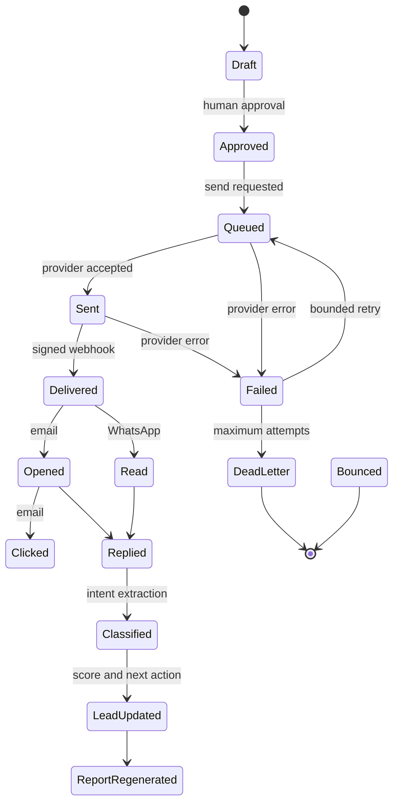
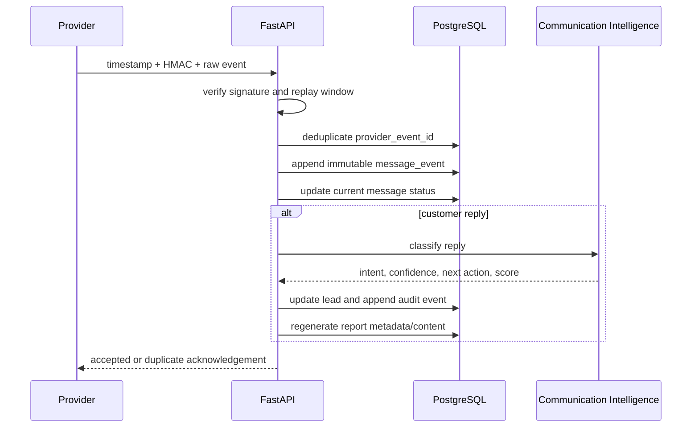

# Communication Lifecycle

```mermaid
stateDiagram-v2
    [*] --> Draft
    Draft --> Approved: human approval
    Approved --> Queued: send requested
    Queued --> Sent: provider accepted
    Sent --> Delivered: signed webhook
    Delivered --> Opened: email
    Delivered --> Read: WhatsApp
    Opened --> Clicked: email
    Opened --> Replied
    Read --> Replied
    Replied --> Classified: intent extraction
    Classified --> LeadUpdated: score and next action
    LeadUpdated --> ReportRegenerated

    Queued --> Failed: provider error
    Sent --> Failed: provider error
    Failed --> Queued: bounded retry
    Failed --> DeadLetter: maximum attempts
    Bounced --> [*]
    DeadLetter --> [*]
```

## Webhook path

```mermaid
sequenceDiagram
    participant Provider
    participant API as FastAPI
    participant DB as PostgreSQL
    participant Agent as Communication Intelligence

    Provider->>API: timestamp + HMAC + raw event
    API->>API: verify signature and replay window
    API->>DB: deduplicate provider_event_id
    API->>DB: append immutable message_event
    API->>DB: update current message status
    alt customer reply
        API->>Agent: classify reply
        Agent-->>API: intent, confidence, next action, score
        API->>DB: update lead and append audit event
        API->>DB: regenerate report metadata/content
    end
    API-->>Provider: accepted or duplicate acknowledgement
```

Delivery remains disabled unless configuration, tenant channel settings, message approval, and the master kill switch all permit it.
