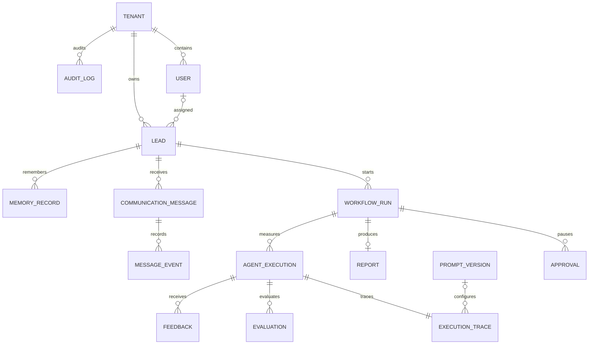

# Database Schema

All business entities carry `tenant_id`. Important uniqueness boundaries include `(run_id, approval_kind)`, one report per run, one feedback item per execution/user, and globally unique provider event IDs. Audit and message events are append-only.

Full catalog: [../database-schema.md](../database-schema.md).
