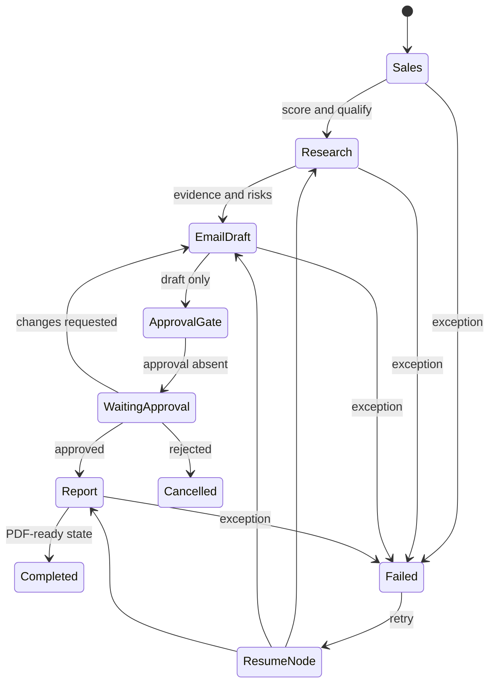

# LangGraph Workflow

Each node records duration, attempt, provider/model, token usage, cost, fallback history, evaluation, and audit evidence. Retry starts from the persisted `resume_node`.

Full design: [../langgraph-workflow.md](../langgraph-workflow.md).
