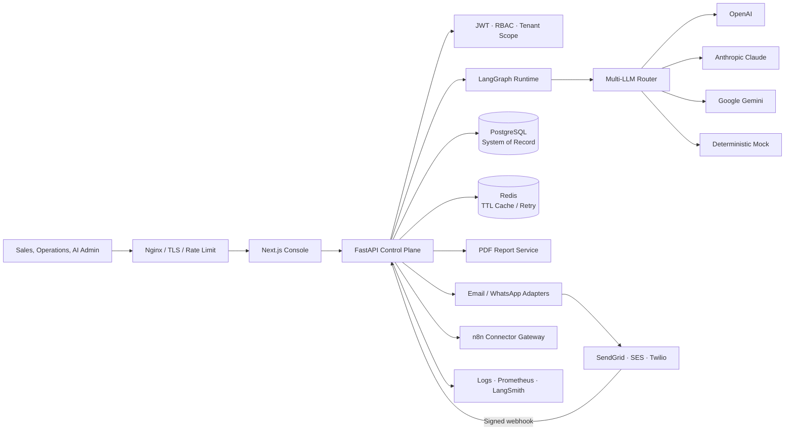

# System Architecture

## Boundaries

- FastAPI owns identity, tenancy, authorization, validation, approval policy, and audit.
- LangGraph owns resumable execution, not permission.
- PostgreSQL is authoritative; Redis failure cannot erase business state.
- Provider payloads are untrusted until signature, replay, and transition validation succeeds.

Full discussion: [../architecture.md](../architecture.md).
