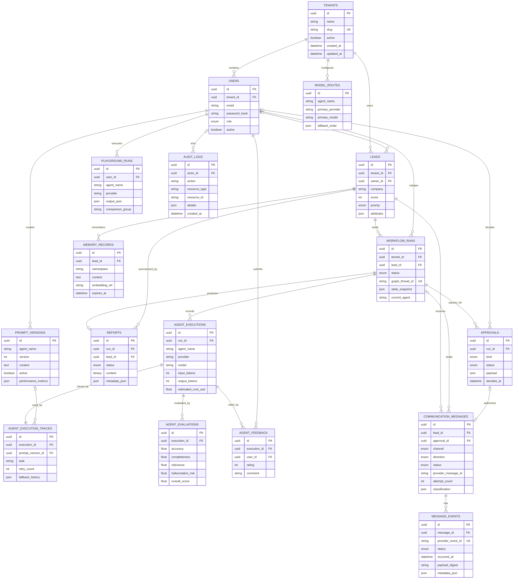

# OrbitOps Database Schema

## 1. Design rules

- UUID primary keys are generated application-side.
- All business tables carry `tenant_id`; the authenticated tenant is never accepted from a request body.
- PostgreSQL is the production database. SQLite is used only for deterministic automated tests and local fallback.
- JSON columns hold bounded flexible metadata; high-value searchable fields remain typed columns.
- Foreign-key delete behavior is explicit: tenant and lead ownership generally cascades, while actor references commonly become null.
- `audit_logs` and `message_events` are append-only.

## 2. Entity relationship diagram

Every table in the diagram except `tenants` also carries `tenant_id`; repeated attributes are omitted where that makes the diagram readable.

## 3. Table catalog

| Table | Purpose | Important constraints/indexes |
|---|---|---|
| `tenants` | Workspace identity and activation | Unique indexed `slug` |
| `users` | Tenant users and roles | Unique `(tenant_id, email)` |
| `leads` | Prospect profile, score, qualification, owner | Indexed tenant; lead archive is represented in `attributes` |
| `workflow_runs` | Durable graph lifecycle and state snapshot | Unique `graph_thread_id`; indexed lead and tenant |
| `approvals` | Human approval request and decision | Unique `(run_id, kind)` prevents duplicate gates |
| `reports` | Generated PDF and report metadata | Unique `run_id` enforces one report per workflow |
| `agent_executions` | Per-node runtime and token/cost data | Indexed run and tenant |
| `agent_execution_traces` | Task timing, retry, prompt, fallback history | One trace per execution |
| `agent_evaluations` | Quality and hallucination-risk scores | Indexed execution and overall score |
| `agent_feedback` | User thumbs-up/down and comment | Unique `(execution_id, user_id)` |
| `prompt_versions` | Versioned per-agent prompt templates | Unique `(tenant_id, agent_name, version)` |
| `model_routes` | Primary and fallback model policy | Unique `(tenant_id, agent_name)` |
| `playground_runs` | Isolated model-comparison results | Indexed comparison group and agent |
| `communication_messages` | Current message lifecycle and retry state | Unique `(tenant_id, provider, provider_message_id)`; approval unique |
| `message_events` | Immutable provider lifecycle history | Globally unique indexed `provider_event_id`; DB trigger blocks mutation |
| `memory_records` | Tenant/lead-scoped memory and embedding reference | Indexed tenant, lead, namespace |
| `audit_logs` | Immutable security/business event history | Indexed tenant, action, created time; DB trigger blocks mutation |

## 4. Lifecycle enumerations

| Domain | Values |
|---|---|
| User role | `admin`, `manager`, `agent_viewer` |
| Workflow | `queued`, `running`, `waiting_approval`, `completed`, `failed`, `cancelled` |
| Approval | `pending`, `approved`, `rejected`, `changes_requested`, `expired` |
| Approval kind | `high_value_lead`, `outbound_email`, `whatsapp_campaign`, `report_publish` |
| Communication | `draft`, `approved`, `queued`, `sent`, `delivered`, `read`, `opened`, `clicked`, `replied`, `bounced`, `failed`, `dead_letter` |
| Report | `generated`, `failed` |

## 5. Migration policy

Alembic migrations are in `apps/api/migrations/versions`:

1. `0001_initial` creates the core model metadata.
2. `0002_immutable_audit` adds PostgreSQL audit immutability.
3. `0003_p1_approval_status` evolves approval status handling.
4. `0004_communication_delivery` adds messages/events and immutable event triggers.
5. `0005_ai_operations` adds prompt, routing, tracing, evaluation, feedback, and playground entities.

Production changes should use expand/migrate/contract: add nullable or backward-compatible structure, deploy compatible code, backfill, then enforce/drop in a later release. Back up and rehearse restore before destructive migrations.

## 6. Scale and retention guidance

- Move large PDF content to versioned, encrypted object storage and keep metadata plus checksum in `reports`.
- Partition `audit_logs`, `message_events`, and `agent_executions` by month once retention volume justifies it.
- Apply tenant-aware PostgreSQL row-level security as defense in depth.
- Define retention by data class: audit/security, communications, AI telemetry, customer memory, and report artifacts.
- Never delete immutable events through application endpoints; use controlled retention/archive jobs with legal approval.
