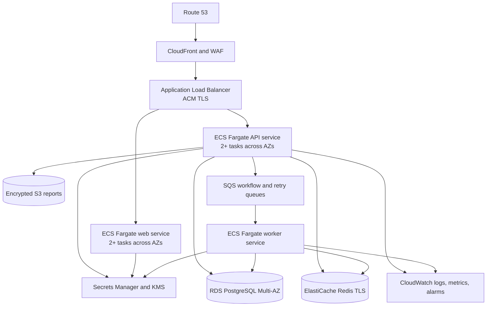

# OrbitOps Deployment Guide

## 1. Deployment modes

| Mode | Purpose | Data services | Delivery |
|---|---|---|---|
| Local application | Fast feedback | SQLite fallback or local PostgreSQL/Redis | Mock |
| Docker Compose | Portfolio demo and integration environment | PostgreSQL 16 + Redis 7 volumes | Disabled/mock by default |
| AWS production | Multi-AZ managed deployment | RDS PostgreSQL + ElastiCache + S3 | Explicitly enabled provider adapters |

Production target versions are Python 3.12 and Node.js 22.

## 2. Docker Compose quick start

### Prerequisites

- Docker Engine/Desktop with Compose v2
- At least 4 GB free memory
- Ports 8080, 3000, and 8000 available

### Configure

Copy `.env.example` to `.env`, then replace every development secret:

```bash
cp .env.example .env
```

PowerShell:

```powershell
Copy-Item .env.example .env
```

Minimum safe changes:

- Generate a random `APP_SECRET_KEY` of at least 32 characters.
- Replace bootstrap admin credentials.
- Replace email and WhatsApp webhook secrets.
- Keep `LLM_DEFAULT_PROVIDER=mock`, `LIVE_LLM_ENABLED=false`, and `DELIVERY_ENABLED=false` for initial validation.
- Set exact CORS origins; do not use `*` with credentials.

### Start and migrate

```bash
docker compose up --build -d
docker compose ps
docker compose logs -f api worker web
```

The API container runs `alembic upgrade head` before starting Uvicorn.

### Verify

```bash
curl http://localhost:8000/health/live
curl http://localhost:8000/health/ready
curl http://localhost:8000/openapi.json
curl http://localhost:8000/metrics
```

Open:

- Nginx application entry: `http://localhost:8080`
- Web directly: `http://localhost:3000`
- API docs: `http://localhost:8000/docs`

Run one synthetic flow: login → create lead → start workflow → approve → generate/download report → inspect audit. Do not enable live delivery during this smoke test.

### Stop and preserve data

```bash
docker compose down
```

Do not add `-v` unless you intentionally want to delete PostgreSQL and Redis volumes.

## 3. Configuration reference

### Core

| Variable | Production rule |
|---|---|
| `APP_ENV` | `production` |
| `APP_SECRET_KEY` | Random secret from Secrets Manager; rotate through controlled session invalidation |
| `DATABASE_URL` | `postgresql+asyncpg` RDS endpoint with TLS |
| `REDIS_URL` | Authenticated, TLS-enabled ElastiCache endpoint |
| `CORS_ORIGINS` | Comma-separated exact console origins |
| `ACCESS_TOKEN_MINUTES` | Default 30; align with risk policy |
| `REFRESH_TOKEN_DAYS` | Default 14; add revocation/rotation before external production |

### AI providers

| Variable | Purpose |
|---|---|
| `LIVE_LLM_ENABLED` | Master switch for real model calls |
| `OPENAI_API_KEY`, `ANTHROPIC_API_KEY`, `GOOGLE_API_KEY` | Provider credentials |
| `*_MODEL` | Default seeded route model |
| `*_COST_PER_MILLION` | Cost estimation based on provider contract |
| `LLM_TIMEOUT_SECONDS` | Per-request timeout; default 45 |
| `LANGSMITH_TRACING` | Optional tracing switch; review sensitive-data policy first |

### Communications

| Variable | Purpose |
|---|---|
| `DELIVERY_ENABLED` | Master outbound-delivery switch; false by default |
| `EMAIL_WEBHOOK_SECRET` | HMAC secret for email lifecycle callbacks |
| `WHATSAPP_WEBHOOK_SECRET` | HMAC secret for WhatsApp callbacks |
| `WEBHOOK_TOLERANCE_SECONDS` | Replay window; default 300 |
| `MESSAGE_MAX_ATTEMPTS` | Retry bound before dead letter; default 3 |
| `TWILIO_*`, `SMTP_URL` | Provider adapter credentials/configuration |

Provider credentials alone must not enable sending. Require `DELIVERY_ENABLED=true`, tenant/channel settings, approved communication state, and a configured adapter.

## 4. AWS production architecture



Use private application/data subnets across at least two availability zones. Only the ALB is internet-facing. Use VPC endpoints for ECR, S3, Secrets Manager, and CloudWatch where appropriate.

## 5. Release process

1. CI runs backend lint/tests, frontend typecheck/build, Playwright E2E, and container build.
2. Build immutable images tagged with commit SHA; scan and push to ECR.
3. Run Alembic migration as a one-off task using the new image.
4. Deploy API/worker/web to staging.
5. Run readiness, synthetic tenant, approval, report, webhook, and no-delivery smoke tests.
6. Require production environment approval.
7. Deploy a small canary; monitor 5xx, latency, workflow failures, retry age, token cost, and webhook rejection.
8. Promote or roll back by immutable image digest.

Do not combine an irreversible migration with a behavior change that depends on it. Use expand/migrate/contract releases.

## 6. Rollback and recovery

- Application rollback: restore the previous ECS task-definition image digest.
- Migration rollback: prefer forward fixes. Use downgrade only when explicitly tested and data-safe.
- Database recovery: enable RDS point-in-time recovery and encrypted snapshots; rehearse restore quarterly.
- Report recovery: enable S3 versioning and lifecycle policies.
- Queue recovery: preserve dead-letter messages and sanitized inputs for replay after root-cause resolution.
- Provider incident: set `DELIVERY_ENABLED=false`, disable affected model routes/channel, and preserve approval/draft state.

## 7. Production readiness checklist

- [ ] All secrets are externalized and development defaults rejected.
- [ ] TLS is enforced from client to managed data services.
- [ ] Database migrations succeed against a production-like PostgreSQL snapshot.
- [ ] RDS backups and restore are tested.
- [ ] Redis/SQS loss and worker restart are tested.
- [ ] WAF, rate limits, request-size limits, and security headers are enabled.
- [ ] Logs are structured, redacted, retained, and correlated by request ID.
- [ ] SLO alarms cover API availability, queue age, agent failures, provider errors, and cost anomalies.
- [ ] Real email/WhatsApp providers are verified in sandbox with test recipients.
- [ ] Webhook signatures and replay protection use production secrets.
- [ ] Tenant isolation and RBAC tests pass in the release candidate.
- [ ] A documented rollback owner and decision threshold exist.

See `infra/aws/README.md` for the infrastructure contract and [Testing report](testing-report.md) for the current software evidence.
