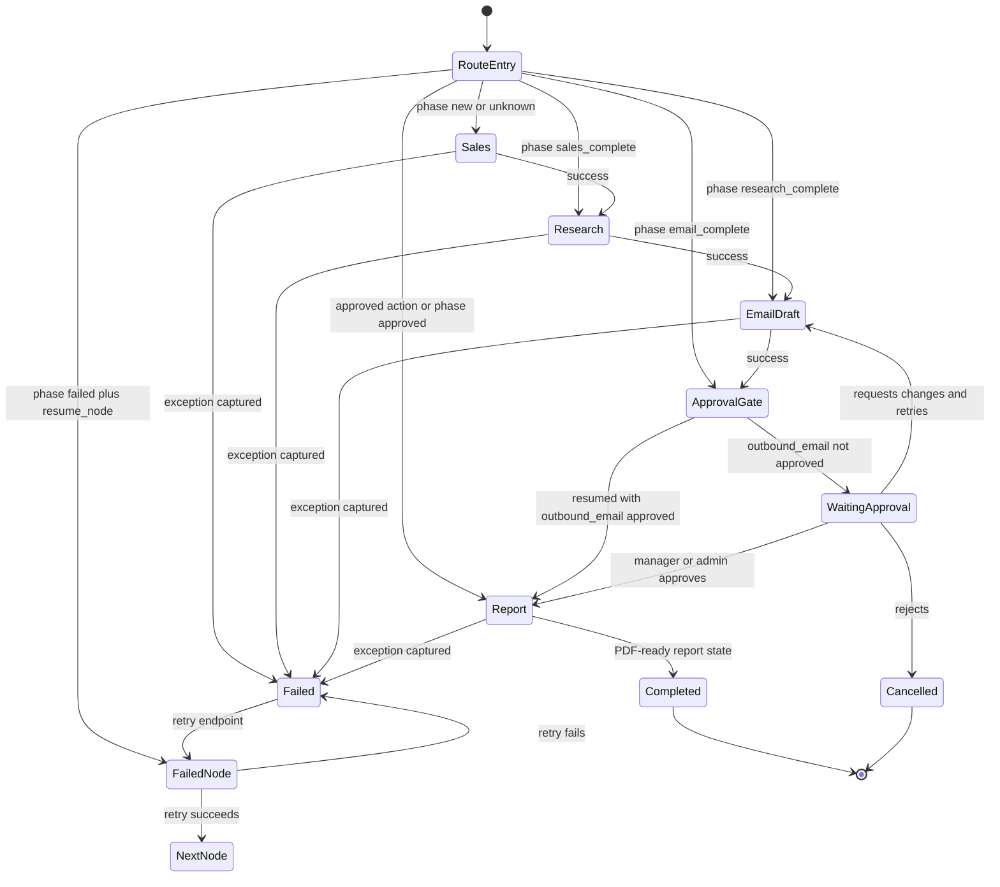
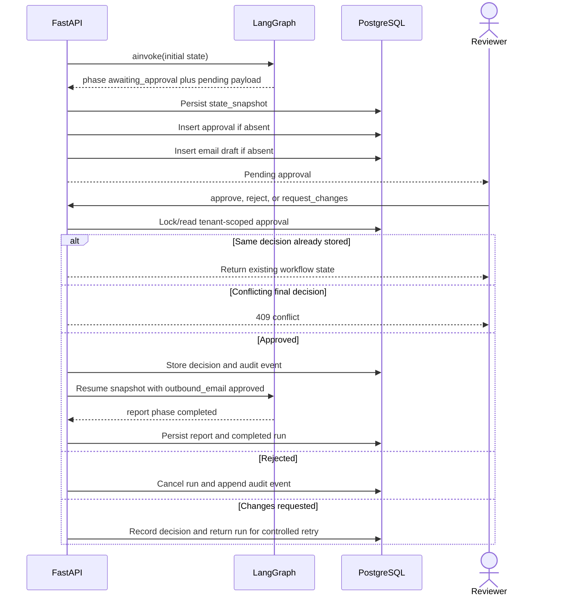

# OrbitOps LangGraph Workflow

## 1. Implemented graph

The compiled graph in `apps/api/app/agents/graph.py` contains five active nodes. WhatsApp delivery is handled by the communication service after approval rather than by a disconnected graph node.

## 2. Node responsibilities

| Node | Inputs | Outputs | External model use |
|---|---|---|---|
| Sales Agent | Lead identity, contact completeness, intent score | `lead_score`, priority, qualification, recommended action | No; deterministic scoring |
| Research Agent | Company, industry, configured prompt and model route | Summary, industry insight, competitors, risks, LLM usage event | Yes; provider-neutral route |
| Email Draft Agent | Lead and research context, email prompt | Subject, body, follow-up sequence, LLM usage event | Yes |
| Approval Gate | Email draft and approved action list | Pending approval or approved phase | No; deterministic policy |
| Report Agent | Approved lead intelligence and report prompt | Structured report, completion event, usage event | Yes |

The mock provider is the safe default. Research output explicitly labels unverified external facts in mock mode.

## 3. Graph state

`AutomationState` is a typed dictionary containing these groups:

- Identity: `tenant_id`, `run_id`, `lead`.
- Sales: score, qualification, priority, recommended action.
- Research: summary, insights, competitors, risks.
- Communication drafts: email, follow-up sequence, WhatsApp message.
- Control: phase, pending approval, approved actions, resume node, errors.
- Report: structured report object.
- Observability: events, LLM calls, node timings.
- Configuration snapshot: model routes and active prompt templates.

The configuration snapshot ensures a run records which route/prompt influenced its output even if administrators later update defaults.

## 4. Approval and resume sequence

## 5. Failure and retry behavior

Each node is wrapped by `guarded(name, node)`:

1. Record start time and attempt number.
2. Execute the node.
3. On success, append completion timing and latency.
4. On exception, return `phase=failed`, set `resume_node`, append a sanitized error, and record the exception class as `error_category`.
5. Persist the failed execution, trace, deterministic evaluation, workflow error audit event, and durable snapshot.
6. `POST /workflows/{run_id}/retry` loads the tenant-scoped snapshot. `route_entry` sends execution directly to `resume_node`.

Completed upstream nodes are not repeated. Retry count is derived from the recorded attempt number.

## 6. Persistence and checkpoints

- `workflow_runs.state_snapshot` is the durable checkpoint.
- `graph_thread_id` is unique and provides a stable execution identity.
- Redis caches the latest active state for one hour under a tenant/run key.
- Redis failure is non-fatal; retry/resume uses PostgreSQL.
- Every new agent event becomes an `agent_executions` record, execution trace, evaluation, and `agent.step_completed` audit event.
- Report generation is idempotent by the unique report `run_id` and an existence check.

## 7. Multi-LLM routing

The default routes seeded per tenant are:

| Agent | Primary | Fallback principle |
|---|---|---|
| Research | Google Gemini | OpenAI → Anthropic → mock, excluding the primary |
| Email | OpenAI | Anthropic → Google → mock, excluding the primary |
| Report | Anthropic Claude | OpenAI → Google → mock, excluding the primary |

Administrators can update primary and fallback candidates through the model-routing API. Each completion records provider, model, token usage, estimated cost, latency, and fallback history.

## 8. Extension contract

To connect WhatsApp as a graph node, add `whatsapp_agent` and `whatsapp_gate` after approved email, then preserve the same deterministic consent/approval rule. Do not let a prompt decide whether a recipient may be contacted. For asynchronous production execution, publish `run_id` to Redis Streams or SQS; keep the API as the only writer of workflow intent and make workers idempotent by run ID.
