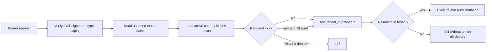

# OrbitOps RBAC and Tenant Isolation

## 1. Roles

| Role | Intended user | Authority |
|---|---|---|
| `admin` | Workspace owner / platform administrator | Full tenant administration, AI configuration, and operational actions |
| `manager` | Sales or operations manager | Manage leads and workflows, decide approvals, send communications, regenerate reports, view audit |
| `agent_viewer` | Analyst, reviewer, or read-only operator | Read tenant operations and AI telemetry; submit personal output feedback |

There is no global cross-tenant role in the current application. An admin is an admin only inside the tenant encoded in the authenticated token.

## 2. Permission matrix

Legend: **R** read, **C** create, **U** update/action, **A** approve/decide, **—** denied.

| Resource/action | Admin | Manager | Agent Viewer |
|---|:---:|:---:|:---:|
| Dashboard and communication analytics | R | R | R |
| Leads: list/detail/timeline | R | R | R |
| Leads: create/update/archive | C/U | C/U | — |
| Workflows: list | R | R | R |
| Workflows: start/retry | C/U | C/U | — |
| Approvals: list/history | R | R | R |
| Approvals: approve/reject/request changes | A | A | — |
| Reports: list/preview/download | R | R | R |
| Reports: regenerate | U | U | — |
| Communications: list/events | R | R | R |
| Communications: create/approve/send/retry | C/U | C/U | — |
| Agent metrics/executions/evaluations | R | R | R |
| Agent output feedback | C/U own | C/U own | C/U own |
| Audit logs | R | R | — |
| Users: list/create/role/activation | C/R/U | — | — |
| Tenant settings and secrets | R/U | — | — |
| Prompt versions and activation | C/R/U | — | — |
| Model routing policy | R/U | — | — |
| Agent playground | C/R | — | — |
| Signed provider webhook | Signature | Signature | Signature |

## 3. Enforcement path

`current_user` validates identity and tenancy. `require_roles(...)` adds endpoint-level role checks. Resource queries then add a tenant predicate, providing object-level isolation.

## 4. Security invariants

1. Never accept `tenant_id`, `role`, `decided_by`, or audit actor from a client payload.
2. Never fetch a tenant-owned object by primary key alone in a request handler.
3. Return `404`, not “belongs to another tenant,” for inaccessible identifiers.
4. Admin operations remain tenant-scoped.
5. Approval and delivery actions always write an audit event.
6. Agent Viewer feedback is scoped to the authenticated user and tenant execution.
7. UI hiding is convenience only; FastAPI is the authorization boundary.

## 5. Tested authorization scenarios

Automated tests cover:

- JWT tenant claim and active-user lookup.
- Agent Viewer denial for privileged mutations.
- Manager access to lead, workflow, approval, communication, report, and audit operations.
- Admin-only user/settings and AI-control endpoints.
- Tenant A inability to access Tenant B leads, workflows, executions, communications, and AI configuration.
- Webhook lookup without leaking unrelated tenant data.

See [Testing report](testing-report.md) for current evidence.

## 6. Change checklist

For every new endpoint:

- Classify it as public, signed-provider, any authenticated user, manager/admin, or admin-only.
- Apply `current_user` or `require_roles` explicitly.
- Add `tenant_id` to every business query and mutation.
- Add positive, denied-role, and cross-tenant tests.
- Audit state-changing security/business actions.
- Update this matrix and the [API reference](api.md).
